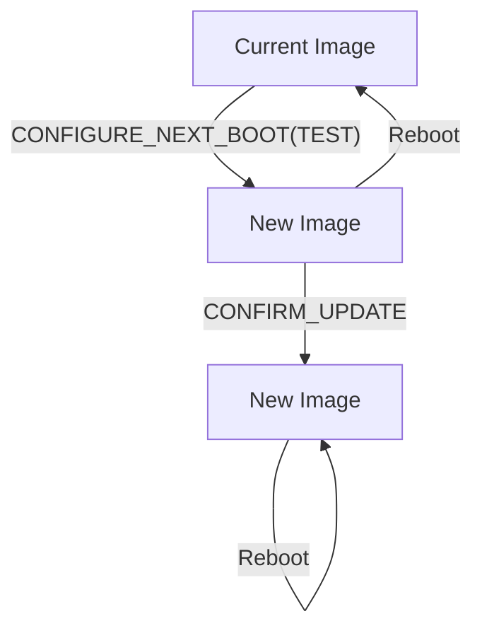
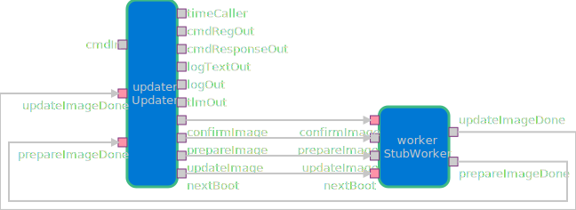

# Update::Updater

Component that provides a standard interface for updating flight software. This allows users to update their flight software from a file on the file system.

## Update Process

The acceptance of new software images is designed to be performed in four steps:

1. First, the media is prepared for a new image
2. Second, the new images is written to underlying media
3. Third, the new images is booted exactly once, with automatic fallback to the previous image
4. Finally, the new image is booted permanently once it is confirmed as sufficiently stable

This process is represented by the following 4 commands:

1. `PREPARE_IMAGE`
2. `UPDATE_IMAGE_FROM_FILE`
3. `CONFIGURE_NEXT_BOOT` with mode `TEST`
4. `CONFIRM_UPDATE`

The high-level update process is captured below.

## Design

This component is designed to work with an implementation of the `UpdateWorker` component. The `UpdateWorker` is provided by the project in order to work with the specific underlying media. This is done via the `UpdateWorkerClient` interface.

